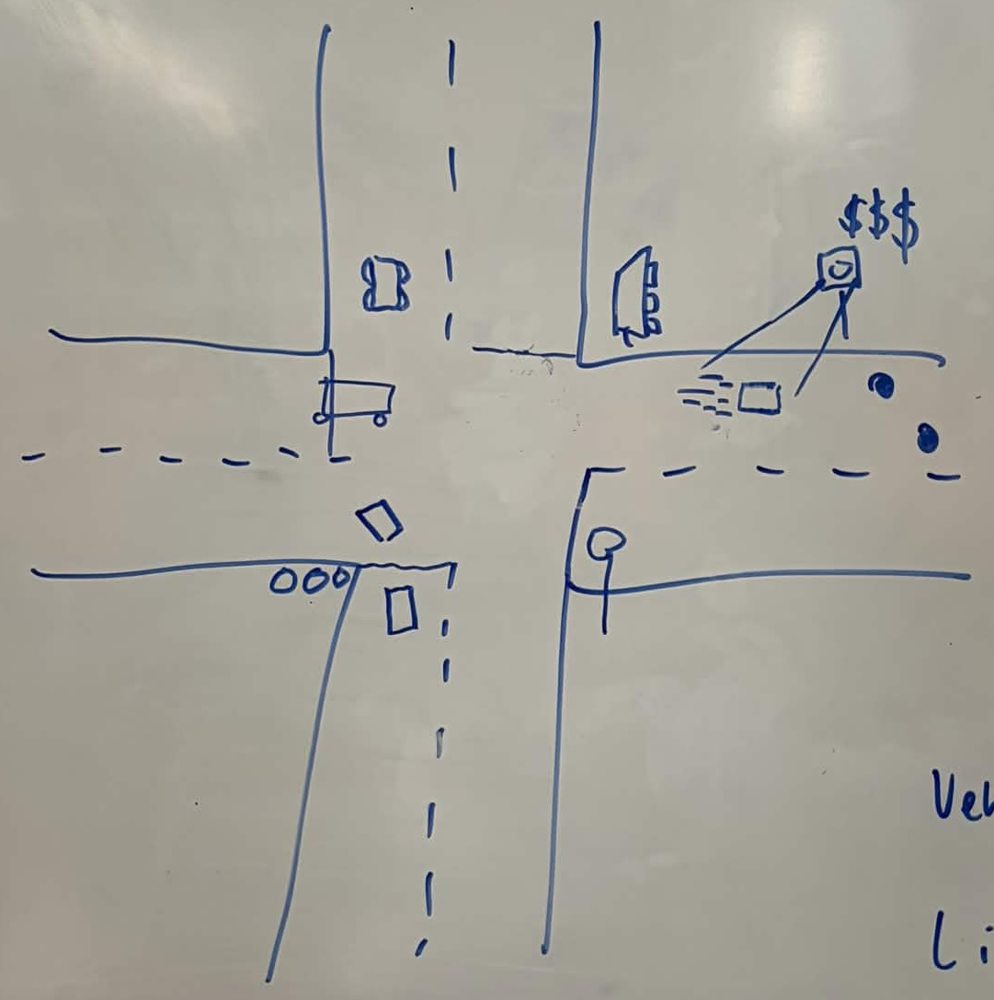

# SSDCTN Traffic Simulator
A running design brief for the project.  
_Please update this document in step with our progress and goals._  

## Vehicle
Vehicles travel on the `Path` subclass `Road`

A vehicle's default action is to accelerate towards its top speed.  
Vehicle's will have a collision zone, objects entering impeded by obstacles, namely speed limits and congestion.  

### Cyclist
The same as vehicles?

## Pedestrian
Pedestrians move within `Footpath` objects.  

## Path
`Path` is the parent class for `Road` and `Footpath`  

A `Path` is a bounding box for objects.  
Paths contain `Obstacle` objects, and subclasses contain other objects.  

### Road
A `Road` contains `Vehicle` objects and has a speed limit.  

### Footpath
A `Footpath` contains `Pedestrian` objects

## Obstacles
Obstacles prevent or alter the movement of Vehicles and Pedestrians who encounter them.  

Obstacles may be  
 - **stationary**, e.g. potholes, stopped vehicles
 - **dynamic**, e.g. vehicles, cyclists, 

_From a vehicle's perspective, pedestrians crossing the road probably function as temporary stationary obstacle. Like, cars won't try and drive in between them_  

## Design Evolution
### Current Goal
A 4-way intersection with vehicles moving N <-> S and E <-> W (maybe no turning yet).  
Traffic lights should control an alternating flow of vehicles through the intersection.  
Bus can stop at bus stops (holding up traffic)?

**First Conceptual Design** – _week 3 class_  
  

### In next design, include:  
 - footpaths  
 - pedestrian crossings  
 - representation for all vehicle types
 - unified traffic light design